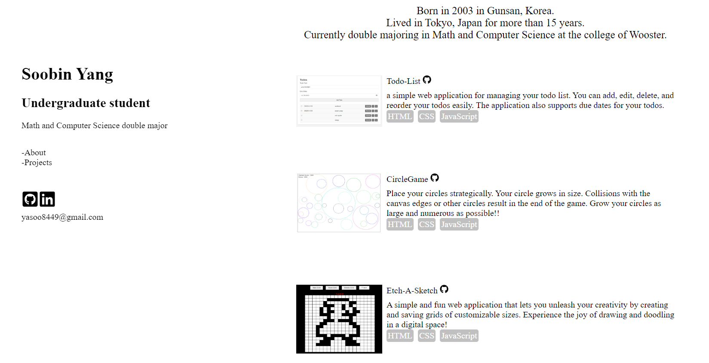

# My Portfolio Website

Welcome to my portfolio website! This site serves as a showcase of my skills, projects, and personal information. Below, you'll find a brief overview of the site structure and components.
[Visit My Portfolio!!](https://uliba3.github.io/portfolio/)

## Table of Contents

1. [Introduction](#introduction)
2. [Site Structure](#site-structure)
3. [Components](#components)
4. [How to Run the Project](#how-to-run-the-project)
5. [Customization](#customization)
6. [Acknowledgments](#acknowledgments)

## Introduction

This portfolio website is a representation of my professional and personal identity. It is designed to provide visitors with an overview of who I am, my skills, and the projects I have worked on. The site is built using React.js for a dynamic and responsive user experience.

## Site Structure

The website is divided into three main sections:

- **Header**: The header section is fixed at the top of the page and includes information about me. It consists of a profile section, navigation links, and additional links.

- **Main**: The main section is the core content area of the site. It includes subsections for the 'About' and 'Projects.' The content is arranged in a clean and visually appealing layout.

## Components

### Header

The header is designed to provide essential information and navigation. It is composed of the following components:

- **Profile**: A brief overview of who I am, including my name, title, and a profile picture.

- **Navigation**: Navigation links to guide visitors to different sections of the site, providing a smooth and intuitive browsing experience.

- **Links**: Additional links, such as social media profiles or a resume, are included in this section for easy access.

### Main

The main section is divided into two components:

- **About**: This section provides more detailed information about me, including my background, skills, and interests.

- **Projects**: A showcase of the projects I have worked on. Each project includes a brief description and relevant links or images.

## How to Run the Project

To run this project locally, follow these steps:

1. Clone the repository: `git clone https://github.com/your-username/your-portfolio.git`
2. Navigate to the project directory: `cd your-portfolio`
3. Install dependencies: `npm install`
4. Start the development server: `npm start`

## Customization

Feel free to customize this portfolio to better suit your preferences. Update the content, add new sections, or modify the styling to make it your own. The site is designed to be easily adaptable to showcase your unique identity.

## Acknowledgments

Special thanks to the React.js community for providing a powerful and flexible framework. The project structure and components are inspired by best practices in React development.

Feel free to reach out if you have any questions or suggestions for improvement. Happy coding!